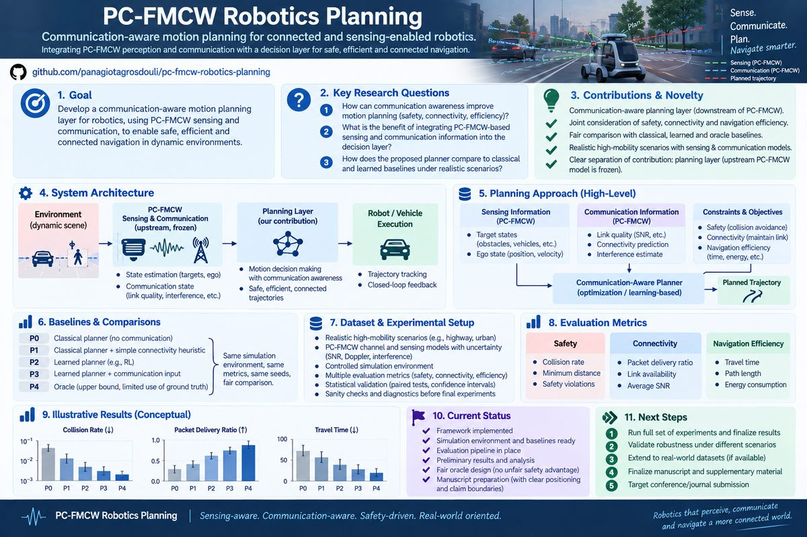

# PC-FMCW Robotics Planning

Predictive connectivity-aware autonomous motion planning from a PC-FMCW integrated sensing/communication architecture, complemented by a field-measured vehicular-QoS validation branch.



## What this repository has become

This repository started as a robotics extension of the PC-FMCW laser-headlamp ISCAI architecture. It now contains **two deliberately separated research tracks** that share one decision-layer question: when is future communication information useful enough, and trustworthy enough, to influence autonomous vehicle motion?

The two tracks are not treated as interchangeable evidence. The first is a **PC-FMCW-informed controlled simulation study**. The second uses **field-measured vehicular communication data** to test the general predictive-planning principle under real QoS variation. Real V2X measurements are never presented as PC-FMCW optical measurements or as validation of the PC-FMCW propagation model.

The intended publication split is therefore:

1. **Paper 1 — PC-FMCW perception-to-action robotics:** technology-specific predictive connectivity-aware motion planning built downstream of PC-FMCW sensing/tracking.
2. **Paper 2 — Measurement-support-aware V2X planning:** real-data predictive QoS planning with explicit anti-leakage, empirical-support, uncertainty, and counterfactual-validity analysis.

This split is intentional rather than salami slicing: the two studies have different primary research questions, evidence sources, validity threats, and main contributions.

---

# Paper 1 — PC-FMCW Predictive Connectivity-Aware Robotics

## Research question

Can future PC-FMCW-informed communication quality be used by an autonomous vehicle planner to change ego motion proactively, before connectivity degradation occurs, while preserving common hard safety constraints?

## Where the robotics contribution starts

The upstream system is treated as frozen as far as possible. Conceptually:

```text
PC-FMCW waveform / communication / sensing
        ↓
Target detection and tracking
        ↓
Target-state history
        ↓
Target-motion prediction
        ↓
Candidate ego trajectories
        ↓
Hard safety filtering
        ↓
Trajectory-conditioned future optical-link prediction
        ↓
Mobility + connectivity + risk evaluation
        ↓
Receding-horizon ego-motion decision
```

The contribution is therefore the **perception-to-action decision layer**, not a claim to redesign the PC-FMCW waveform, DPSK coding, coherent receiver, or upstream tracking front end.

See [`docs/PC_FMCW_ROBOTICS_BRIDGE.md`](docs/PC_FMCW_ROBOTICS_BRIDGE.md), [`docs/PAPER_METHODS.md`](docs/PAPER_METHODS.md), and [`docs/PC_FMCW_PARAMETER_AUDIT.md`](docs/PC_FMCW_PARAMETER_AUDIT.md).

## P0–P4 planner family

- **P0 — Mobility-only:** connectivity is ignored in the objective; the common predicted target is still used for safety.
- **P1 — Reactive connectivity-aware:** uses current/myopic communication information.
- **P2 — Predictive connectivity-aware:** scores candidate trajectories using predicted future communication state.
- **P3 — Predictive risk-aware:** augments P2 with uncertainty/risk propagation.
- **P4 — Oracle connectivity reference:** simulator future truth may be used only for the connectivity forecast; it is not allowed to give P4 privileged collision-avoidance information.

All variants share candidate generation, vehicle limits, road constraints, static-obstacle filtering, and time-aligned dynamic-target safety. This makes P2-vs-P1 and P3-vs-P2 meaningful comparisons rather than comparisons between different safety systems.

## PC-FMCW-informed link model

The planner queries an analytical/surrogate connectivity model using future relative ego/target geometry. The model exposes communication quantities such as modeled SNR, BER, outage, and goodput. Distance loss and directional/angular beam loss are represented separately.

This is explicitly a **PC-FMCW-informed analytical connectivity model**, not a calibrated physical optical channel. Parameters traceable to the upstream study are kept distinct from robotics-side modeling assumptions. In particular, the repository does not infer visible-light propagation calibration from the upstream carrier-frequency entry; provenance and interpretation are documented in the parameter audit.

## Optical mechanism ablation

A dedicated mechanism experiment compares:

```text
default directional model = distance loss + angular/beam loss
vs.
distance-only model       = distance loss with angular penalty removed
```

The planner, scenarios, and seeds are held fixed. The purpose is to test whether the predictive-planning effect depends on the directional optical geometry rather than merely reproducing generic distance-aware motion planning. This is a mechanism ablation, not physical optical validation.

## Confirmatory protocol

The paper protocol freezes a 50-seed confirmatory set (`1000..1049`). Historical exploratory/20-seed results are not allowed to override the frozen confirmatory evidence.

For global confirmatory inference, repeated scenarios from one simulation seed are not treated as independent samples. Paired planner effects are first aggregated within seed; inference is then performed over independent seed-level effects using deterministic bootstrap confidence intervals, paired Wilcoxon tests where appropriate, and Holm correction across the predeclared comparison family.

The main confirmatory comparisons are P2 vs P1, P3 vs P2, and the oracle gap where scientifically meaningful. Scenario-level analyses remain useful diagnostics but are not used to inflate the confirmatory sample size.

## Paper-1 claim boundary

What this branch can support, subject to the frozen results:

- a closed-loop robotics extension downstream of PC-FMCW sensing/tracking;
- predictive trajectory-conditioned communication evaluation;
- safety-constrained receding-horizon motion selection;
- analysis of prediction, risk, and oracle references under common safety information;
- directional-vs-distance-only mechanism analysis;
- controlled simulation evidence with reproducible paired statistics.

What it must **not** claim:

- measured PC-FMCW optical-channel validation;
- real-road autonomous-driving validation;
- that communication-aware planning itself is new;
- that optical/FSO/ISAC trajectory optimization itself is new;
- physical calibration that is not supported by upstream measurements.

---

# Paper 2 — Field-Measured V2X Predictive Planning

## Research question

When can an autonomous planner trust a learned future-connectivity estimate from field measurements while evaluating motion decisions that were not necessarily observed in the original drive?

This question arose from a fundamental counterfactual problem. A drive dataset records QoS along the trajectory that was actually driven. A planner asks what would happen under alternative future motion. Those are not automatically equivalent. The repository therefore treats **measurement support and counterfactual validity as first-class experimental variables** rather than silently assigning measured truth to unobserved locations.

## Real dataset

The implemented real-data branch uses CICV5G field measurements. The downloaded research snapshot contains:

- **38 measured runs/drives**;
- **43,045 synchronized samples** used by the repository pipeline;
- vehicle/trajectory context and measured communication variables used for QoS prediction and replay.

Raw measurements are not fabricated or committed as synthetic replacements. Dataset provenance, acquisition, preprocessing, split manifests, and generated experiment artifacts are kept separate from the PC-FMCW simulation branch.

## Anti-leakage design

Wireless/vehicular time series are highly autocorrelated. Random row-level splitting can therefore produce misleadingly strong prediction results. The real-data pipeline uses grouped/whole-drive separation and explicitly evaluates prediction under held-out runs.

The project uses multiple grouped train/calibration/test assignments as **sensitivity analysis**. Because those assignments reuse the same finite collection of drives, the five split assignments are not treated as five independent experimental populations.

## Lightweight QoS prediction

The project intentionally benchmarks transparent lightweight predictors rather than assuming that a large neural model is necessary. Baselines include persistence and simple spatial/data-driven predictors. A key empirical observation is that **current-value persistence is a strong short-horizon baseline**; naive machine-learning models do not automatically beat it.

The scientifically relevant question is therefore not simply whether QoS can be predicted, but whether prediction provides useful information at the **decision horizon** where an autonomous vehicle can alter its trajectory.

Planning-horizon experiments show that predictive value becomes more meaningful at longer future horizons than at the immediate next sample. The repository keeps predictor evaluation separate from planner evaluation so that a good regression score is not automatically interpreted as decision benefit.

## Empirical measurement support

For every candidate query the pipeline can audit whether the requested state lies in a region supported by training measurements. Diagnostics include quantities such as nearest-training-measurement distance, local support/density, and unsupported/OOD indicators where justified.

This lets the planner distinguish:

```text
prediction in well-supported measured region
from
prediction requiring substantial extrapolation
```

The analysis found that support-related error is context dependent rather than a universal monotonic law: degradation is concentrated in particular low-support contexts/segments. The paper therefore does not claim that prediction error must always increase monotonically with distance from training data.

## Route-constrained measured replay

To avoid fabricated counterfactual ground truth, the strongest real-data planner experiment uses a route-constrained measured-support replay. P0/P1/P2/P3 choose among admissible future decisions derived from measured route support, while future measured QoS is revealed only after the planner's decision for outcome evaluation.

This preserves the causal information boundary: a deployable planner cannot inspect future test measurements before choosing.

## Main measured-V2X finding

Across five grouped split assignments, the P2-minus-P1 difference in mean measured delay was:

```text
-0.792 ms
-1.253 ms
-0.069 ms
-0.263 ms
-0.130 ms
```

The direction is therefore favorable to predictive P2 in **5/5 split assignments**. The corresponding >50-ms experimental violation fraction also moved in the favorable direction across all five assignments.

These five split effects are reported as robustness/sensitivity evidence, not as five statistically independent replications.

## What P3 actually contributes

The experiments do **not** support a blanket claim that P3 improves communication QoS over P2. Its delay effect changes across split assignments.

What is consistent is a reduction in unsupported-selection exposure. The interpretation is therefore deliberately separated:

```text
P2 → predictive communication utility
P3 → empirical-support / validity-risk control
```

This negative/nuanced result is retained rather than forcing a monotonic `P3 > P2 > P1 > P0` story.

## Statistical discipline

The real-data analysis uses held-out run/drive units rather than treating thousands of correlated timestamps as thousands of independent experiments. Primary paired tests use bootstrap effect intervals and paired non-parametric testing where appropriate, with Holm multiplicity correction for the declared family.

Multiple grouped split assignments are used to assess directional robustness and sensitivity to partition choice, not to manufacture a larger independent sample size.

## Paper-2 claim boundary

What this branch can support:

- lightweight future-QoS prediction from field-measured vehicular communication data;
- anti-leakage whole-drive evaluation;
- decision-horizon analysis rather than one-step-only prediction;
- predictive-vs-reactive route-constrained planning under measured outcomes;
- explicit empirical-support auditing for counterfactual queries;
- support/risk-aware planning behavior;
- reproducible real-data replay evidence.

What it must **not** claim:

- that CICV5G validates the PC-FMCW optical model;
- arbitrary real-world QoS ground truth at unmeasured counterfactual locations;
- real-road closed-loop autonomous-driving validation;
- that generic radio-map or communication-aware planning is novel;
- that P3 consistently improves QoS over P2;
- independent replication from split assignments that reuse the same drives.

Detailed paper-ready material is under [`docs/paper/`](docs/paper/), including contributions, methods, experimental setup, results, discussion, limitations, related work, and the dual-branch evidence matrix.

---

# Why two papers rather than one oversized paper?

The common decision layer is valuable, but the evidence answers two different scientific questions.

| | Paper 1 | Paper 2 |
|---|---|---|
| Primary domain | PC-FMCW / optical ISCAI robotics | Measured vehicular V2X / telecom-robotics |
| Evidence | Controlled seeded simulation | Field-measured QoS + offline replay |
| Main question | Can PC-FMCW-informed future connectivity improve ego-motion decisions? | When can measured-data connectivity prediction be trusted for planning? |
| Main validity threat | Fidelity of analytical optical surrogate | Leakage and unsupported counterfactual extrapolation |
| Key mechanism | Directional geometry + future target/link prediction | QoS horizon prediction + empirical measurement support |
| Core comparison | P2 vs P1; P3 vs P2; mechanism/oracle analyses | Predictive P2 vs reactive P1; support-aware P3 vs P2 |
| Claim level | Model-based PC-FMCW-informed robotics | Field-measured communication replay |

The papers can cross-reference the shared planning architecture, but each must retain its own primary hypothesis, experimental evidence, limitations, and contribution statement.

---

# Repository-wide planning pipeline

The common abstraction is:

```text
state / sensing history
        ↓
future state prediction
        ↓
candidate ego trajectories
        ↓
common hard safety filter
        ↓
future communication estimate
        ↓
communication uncertainty / support assessment
        ↓
trajectory scoring
        ↓
first-control execution
        ↓
replan
```

The communication-estimation block changes between the two papers:

- **PC-FMCW branch:** relative geometry → PC-FMCW-informed analytical optical QoS.
- **Real-V2X branch:** causal measurement history/context → learned future QoS + empirical support.

This separation allows us to study which conclusions are technology-specific and which belong to the autonomous decision layer itself.

# What has been implemented

The repository now includes the following research infrastructure:

- closed-loop P0–P4 planner benchmark;
- target prediction and trajectory-conditioned connectivity evaluation;
- common dynamic/static safety filtering;
- PC-FMCW-informed SNR/BER/outage/goodput modeling;
- directional optical geometry modeling;
- distance-only optical mechanism ablation;
- frozen 50-seed confirmatory protocol;
- seed-level confirmatory statistical analysis to avoid scenario pseudoreplication;
- bootstrap confidence intervals, paired Wilcoxon testing, and Holm correction;
- real CICV5G dataset acquisition/preprocessing pipeline;
- whole-drive anti-leakage splits;
- lightweight QoS predictor benchmarking;
- planning-horizon sweeps;
- uncertainty/calibration machinery;
- empirical spatial-support diagnostics;
- route-constrained measured-QoS replay;
- P0/P1/P2/P3 real-data planner comparison;
- five grouped split sensitivity assignments;
- decision-time measurement;
- negative-result and failure-mode reporting;
- provenance manifests, deterministic seeds, tests, CI workflows, and machine-readable outputs;
- literature/gap analysis and explicit claim audits;
- paper-ready real-V2X methods/results/discussion/limitations documents;
- cross-branch evidence and publication-positioning documents.

# Reproduction

## Core PC-FMCW benchmark

```bash
pip install -r requirements.txt
python scripts/run_pc_fmcw_robotics_benchmark.py --seeds 10
```

The frozen paper protocol and exact large-seed execution instructions are documented in [`docs/PAPER_FREEZE.md`](docs/PAPER_FREEZE.md) and [`docs/PART_B_COMPLETION_PLAN.md`](docs/PART_B_COMPLETION_PLAN.md).

## Real-V2X research branch

See the real-data experiment configuration and scripts in the repository together with [`docs/paper/EXPERIMENTAL_SETUP_REAL_V2X.md`](docs/paper/EXPERIMENTAL_SETUP_REAL_V2X.md) and [`docs/paper/METHODS_REAL_V2X.md`](docs/paper/METHODS_REAL_V2X.md). Dataset provenance and split rules must be preserved when reproducing results; row-randomized train/test splitting is not an acceptable substitute.

# Research integrity and reporting rules

Before turning any output into a manuscript claim, use [`docs/EXPERIMENT_REPORTING_CHECKLIST.md`](docs/EXPERIMENT_REPORTING_CHECKLIST.md) and the paper evidence/claim documents.

The repository follows four evidence labels:

- **UPSTREAM:** directly traceable to the original PC-FMCW study.
- **MODELED:** generated by the PC-FMCW-informed analytical/simulation branch.
- **MEASURED:** directly present in the real vehicular dataset.
- **LEARNED/DERIVED:** predicted or computed from measured/model inputs.

These categories must not be silently mixed.

# Current status

**Dual-paper research framework implemented and integrated on `main`.** The real-V2X branch has completed measured-data prediction, support-aware replay, multi-split robustness, and multiplicity-aware analysis. The PC-FMCW branch contains the frozen 50-seed confirmatory protocol and optical directional-mechanism ablation; final manuscript numerical claims must use the frozen confirmatory artifact once complete rather than historical exploratory numbers.

The repository should now be read as a reproducible research program rather than a single planner demo: **Paper 1 studies PC-FMCW-informed perception-to-action planning; Paper 2 studies trustworthy predictive connectivity planning with field-measured vehicular QoS.**
